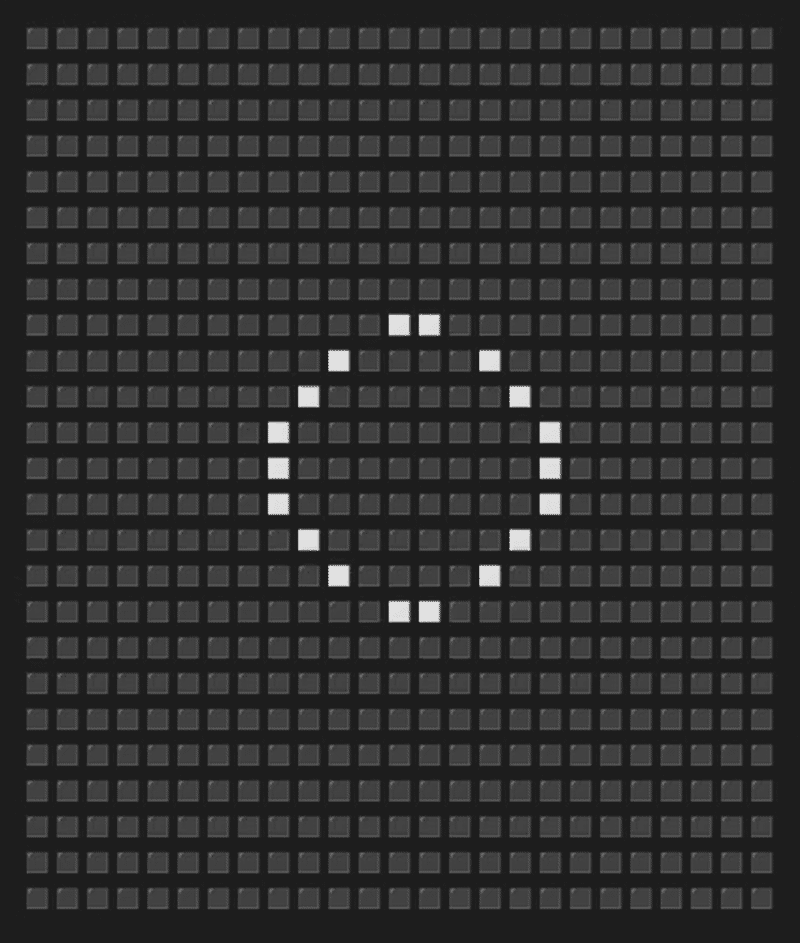

# haskells-game-of-life

Conways "Game Of Life" in Haskell




# Binary releases

- releases can be found [here](https://github.com/Fabus1184/haskells-game-of-life/releases)

- libgmp may be required

# Building from Source

- requires recent cabal and ghc versions

clone repository:
```
git clone https://github.com/Fabus1184/haskells-game-of-life.git && cd haskells-game-of-life
```

build & run cabal project
```
cabal build && cabal run
```